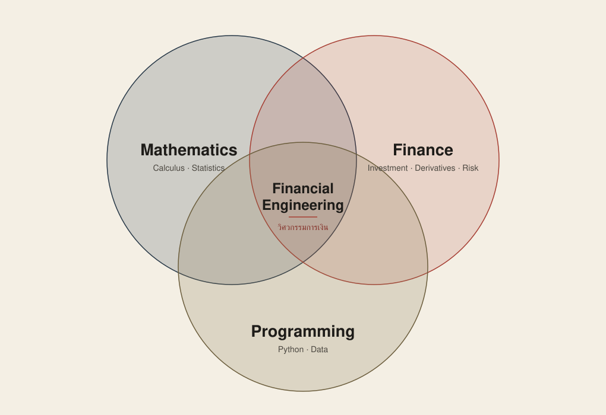

**สรุปก่อน**

- **เรียนอะไร** — การเงิน + คณิตศาสตร์ + สถิติ + การเขียนโปรแกรม เพื่อประเมินมูลค่าตราสาร วัดผลตอบแทนและความเสี่ยง และสร้างแบบจำลองช่วยตัดสินใจ
- **ต้องรู้อะไรก่อน** — Calculus (ทั้งอนุพันธ์และปริพันธ์) กับ Probability ช่วยมาก และควรคุ้นกับการเขียนพิสูจน์เบื้องต้น ส่วนพื้นฐาน Finance กับ Programming ทำให้ตามบทเรียนง่ายขึ้น แต่ไม่จำเป็นต้องจบสายนี้มา
- **เรียนแบบไหน** — คลาสเสาร์เต็มวัน อาทิตย์ครึ่งวัน เลือกได้ทั้ง Online และ On-site สลับได้ทุกสัปดาห์
- **เหมาะกับใคร** — คนที่อยากเข้าใจการเงินผ่านตัวเลขและแบบจำลอง ไม่จำเป็นต้องจบการเงินหรือสายคอมมาโดยตรง แต่ถ้าไม่อยากแตะสมการเลย สาขานี้อาจไม่ตอบโจทย์

---

ผมเริ่มเรียน M.Sc. in Financial Engineering มาได้ประมาณ 3–4 สัปดาห์ เหตุผลหลักไม่ใช่เพราะตัดสินใจว่าจะย้ายออกจากสาย Software Developer แต่อยากเข้าใจการเงินให้ลึกกว่าเดิม ผมอยากนำความรู้มาจัดการ Portfolio และการเทรดส่วนตัวให้เป็นระบบขึ้น พร้อมกับเพิ่มทางเลือกให้ตัวเองในอนาคต

ก่อนเริ่มเรียน ผมเข้าใจคร่าว ๆ ว่าสาขานี้คือการนำคณิตศาสตร์กับโปรแกรมมาช่วยแก้ปัญหาการเงิน แต่พอได้เรียน 3 วิชาแรก—ตราสารอนุพันธ์ สถิติ และทฤษฎีการลงทุน—พร้อมกัน ภาพเริ่มชัดขึ้นว่าไม่ใช่เพียงการเขียนโปรแกรมเกี่ยวกับหุ้น แต่เป็นจุดที่หลายเรื่องต้องทำงานร่วมกัน

บทความนี้จึงไม่ใช่รีวิวหลักสูตรหลังเรียนจบ แต่เป็นภาพจากช่วงเริ่มต้นว่าเรียนอะไรจริง และพื้นฐานแบบไหนที่ผมคิดว่าช่วยให้ตามเนื้อหาได้ทัน

## วิศวกรรมการเงิน (Financial Engineering) คืออะไร

ในมุมที่ผมเข้าใจตอนนี้ วิศวกรรมการเงิน หรือ Financial Engineering คือการนำ **การเงิน คณิตศาสตร์ สถิติ และการเขียนโปรแกรม** มาใช้แก้ปัญหาทางการเงิน ตั้งแต่การประเมินมูลค่าตราสาร วัดผลตอบแทนและความเสี่ยง ไปจนถึงสร้างแบบจำลองเพื่อช่วยตัดสินใจ

คำว่า Engineering ในที่นี้จึงใกล้กับการออกแบบวิธีแก้ปัญหาภายใต้เงื่อนไขต่าง ๆ เราต้องรู้ว่าตัวเลขที่คำนวณแทนอะไร ตั้งสมมติฐานแบบไหน และผลลัพธ์บอกอะไรได้หรือไม่ได้

แผนภาพนี้ช่วยให้เห็นง่ายขึ้นว่า Financial Engineering อยู่ตรงจุดที่ **คณิตศาสตร์** (รวมสถิติ), **การเงิน** และ **การเขียนโปรแกรม** ซ้อนกัน โจทย์อย่าง Option Pricing หรือ Risk Management จึงไม่ได้ใช้ความรู้ด้านใดด้านหนึ่งล้วน ๆ แต่ต้องหยิบหลายด้านมาใช้กับปัญหาเดียวกัน

หลักสูตรที่ผมกำลังเรียนคือ **วิทยาศาสตรมหาบัณฑิต สาขาวิศวกรรมการเงิน (M.Sc. in Financial Engineering)** ของมหาวิทยาลัยหอการค้าไทย (UTCC) เป็นหลักสูตรระดับปริญญาโท ระยะเวลา 2 ปี รวม 42 หน่วยกิต [ข้อมูลของหลักสูตร](https://gs.utcc.ac.th/master-degree/financial-engineering/)

เหตุผลที่ผมเลือกมาเรียนที่นี่ เพราะเป็นมหาวิทยาลัยใกล้ที่พักที่สุด ใช้เวลาเดินทางน้อย และเรียน Online ได้ในสัปดาห์ที่ไม่สะดวกไป Onsite ผมไม่ได้เทียบเนื้อหาหลักสูตรกับมหาวิทยาลัยอื่นอย่างละเอียด ถ้าเงื่อนไขของคุณต่างจากนี้ เช่น ให้น้ำหนักกับชื่อเสียงของหลักสูตรหรือเครือข่ายศิษย์เก่ามากกว่า ก็ควรลองเปรียบเทียบหลักสูตรที่เกี่ยวข้องจากหลาย ๆ ที่ เช่น จุฬาลงกรณ์มหาวิทยาลัย (จุฬาฯ) และสถาบันบัณฑิตพัฒนบริหารศาสตร์ (นิด้า) ก่อนตัดสินใจ

## ค่าเทอมเท่าไหร่

ผมเข้าเรียนปี 2569 ตอนนี้จ่ายไปสองส่วน คือ

- **วิชาปรับพื้นฐาน (3 วิชา)** ประมาณ 18,000 บาท
- **เทอมแรก (3 วิชา)** ประมาณ 38,000 บาท

หลักสูตรนี้มีเรียนภาคฤดูร้อนด้วย ค่าเรียนตลอดหลักสูตรอยู่ที่ประมาณ **220,000 บาท** ใครจะสมัครลองถามค่าเทอมกับมหาวิทยาลัยอีกครั้งนะครับ รุ่นถัดไปอาจไม่เท่ากัน

## วิชาปรับพื้นฐานเรียนอะไร

ก่อนเริ่มเทอมแรกมีเรียนปรับพื้นฐาน 3 วิชา วิชาละ 8 สัปดาห์ ช่วงนี้นับเป็นภาคเรียนที่ 0 ไม่คิดหน่วยกิต ผลเรียนออกเป็น S/U หรือผ่านกับไม่ผ่าน ไม่มีเกรด

- **SM001 แคลคูลัส**
- **SM002 สถิติธุรกิจ**
- **SM004 การโปรแกรมทางการเงินเบื้องต้น**

ถ้าเคยเรียนมาบ้างก็ได้ทบทวน แต่ถ้าไม่เคยเรียนเลย ผมว่า 8 สัปดาห์ไม่ได้เยอะเท่าไหร่ เพราะต้องทำความเข้าใจใหม่หมด

## ช่วงแรกเรียนอะไรบ้าง

เทอมแรกผมลง 3 วิชา วิชาละ 3 ชั่วโมงต่อสัปดาห์ เรียนวันเสาร์ 9:00–12:00 และ 13:00–16:00 ส่วนวันอาทิตย์เรียน 13:00–16:00

ตารางแต่ละเทอมอาจไม่เหมือนกันนะครับ บางเทอมอาจเป็นเสาร์เวลาเดิม แล้วเปลี่ยนจากอาทิตย์ไปเป็นจันทร์ 18:00–21:00 ถ้าต้องวางแผนเรื่องงานด้วย ลองถามตารางกับคณะก่อน

**SM511 — ตราสารหนี้และตราสารอนุพันธ์ (Fixed Income Securities and Derivative Securities)**

เริ่มจาก Futures ตอนนี้เรียนมาถึง Options แล้ว ต้องคำนวณด้วยว่าราคามาจากไหน และ Payoff ณ วันหมดอายุเป็นเท่าไหร่ถ้าราคาหุ้นไปจบที่ค่าต่าง ๆ

ที่เจอแล้วมี Binomial Model ซึ่งสมมติว่าราคาหุ้นแต่ละช่วงขยับได้สองทาง คือขึ้นหรือลง แล้วค่อยคำนวณราคา Option ย้อนกลับมา อีกเรื่องคือ Delta ที่ต้องใช้อนุพันธ์ ตำราหลักใช้ Hull, *Options, Futures, and Other Derivatives*

**SM512 — ทฤษฎีสถิติ (Statistical Theory)**

วิชานี้ผมต้องกลับไปทบทวนเลขเยอะที่สุด เริ่มจากสัจพจน์ของความน่าจะเป็น พิสูจน์ Boole's inequality แล้วต่อด้วย Conditional Probability, Bayes' Theorem, Random Variables และ Probability Distributions

จากนั้นก็เป็น Bivariate Distributions หรือการแจกแจงของตัวแปรสุ่ม 2 ตัวพร้อมกัน เช่น ผลตอบแทนของหุ้น 2 ตัว มีเรื่อง Statistical Independence และการหาการแจกแจงของฟังก์ชันของตัวแปรสุ่มด้วย อย่างการแสดงว่ากำลังสองของตัวแปรปกติมาตรฐานมีการแจกแจงแบบ Chi-square

มี Problem Set เกือบทุกสัปดาห์ ชุดละ 3–5 ข้อ เห็นจำนวนข้อแล้วอาจดูไม่เยอะ แต่ชุดแรกก็เจอ “จงพิสูจน์” แล้วครับ ต้องเขียนอธิบายให้ได้ ไม่ใช่แค่แทนค่าในสูตร แล้วบทถัดไปก็ต่อจากเรื่องเดิมเร็วพอสมควร ตำราหลักใช้ DeGroot & Schervish, *Probability and Statistics* (4th ed., Pearson)

**SM513 — ทฤษฎีการลงทุน (Investment Theory)**

เรียนเรื่อง Market Efficiency ที่มองว่าราคาสะท้อนข้อมูลที่มีอยู่แล้ว การหากำไรส่วนเกินจึงทำได้ยาก ตามด้วย Behavioral Finance และ Security Analysis หรือการวิเคราะห์มูลค่าหลักทรัพย์ ตอนนี้มาถึง Bond Valuation แล้ว ตำราหลักใช้ Bodie, Kane & Marcus, *Investments*

พอเรียนพร้อมกันก็เริ่มเห็นว่าใช้ความรู้ข้ามวิชากันอยู่ อย่าง SM513 ก็ต้องเอาสถิติมาวิเคราะห์ Return ด้วย ไม่ได้เรียนสถิติแค่ตอนเข้า SM512

เรื่องภาษา การบ้านที่ผมได้ใน SM512 เป็นโจทย์ภาษาไทย มีวงเล็บศัพท์อังกฤษไว้ เช่น “ฟังก์ชันความหนาแน่นของความน่าจะเป็น (p.d.f.)” ส่วนตำราทั้งสามเล่มเป็นภาษาอังกฤษ ก็ต้องค่อย ๆ คุ้นกับศัพท์พวกนี้ แต่ไม่ได้ต้องฟังหรือเขียนเป็นอังกฤษทั้งหมด

## Financial Engineering ยากไหม? ต้องเก่งเลขแค่ไหน

สำหรับผม ส่วนที่ต้องกลับไปอ่านเยอะคือเลข โดยเฉพาะ **Algebra กับ Calculus** มีใช้แทบทุกบท ตั้งแต่จัดรูปสมการ หาอนุพันธ์ ไปจนถึงอินทิเกรตหาความน่าจะเป็น ใครเคยเรียนมาแล้วก็ควรทบทวนครับ เพราะต้องหยิบมาใช้ระหว่างเรียนเลย

อย่าง **Delta ของ Option** เขียนเป็น ∂C/∂S คืออนุพันธ์ของราคา Option เทียบกับราคาหุ้นอ้างอิง ถ้าพูดแบบคร่าว ๆ ก็คือ “หุ้นขยับ 1 บาท ราคา Option จะขยับประมาณเท่าไหร่” ถ้าเคยหาอนุพันธ์มาก่อนก็พอจะตามได้ว่ากำลังคำนวณอะไร แต่ถ้าไม่เคยเจอเลย ต้องทำความเข้าใจทั้งเรื่อง Option และอนุพันธ์ไปพร้อมกัน

ฝั่ง SM512 ก็เจอตั้งแต่สัปดาห์แรก ๆ เช่น ให้ f(x) = ce^(−3x) มา แล้วถามว่า c ต้องเป็นเท่าไหร่ถึงจะเป็นฟังก์ชันความหนาแน่นได้ เราต้องอินทิเกรตตั้งแต่ 0 ถึงอนันต์ แล้วให้ผลเท่ากับ 1 พอขยับไปเป็นตัวแปรสุ่ม 2 ตัว ก็ต้องทำ Double Integral บางข้อมีขอบเขตเป็นเส้นโค้ง เช่น 0 ≤ y ≤ 1 − x² ถ้าอินทิเกรตไม่คล่องก็จะติดตรงนี้ก่อนเลย

อีกอย่างที่ผมไม่ได้เตรียมมาคือ **การเขียนพิสูจน์** Problem Set แรกของ SM512 เป็น “จงแสดงว่า” กับ “จงพิสูจน์” ทั้งชุด มีทั้งใช้ induction และ de Morgan's laws พิสูจน์อสมการของความน่าจะเป็น ต้องกลับไปรื้อเรื่องเซต ทั้ง union, intersection, complement แล้วฝึกเขียนเหตุผลทีละขั้น คำนวณเป็นอย่างเดียวไม่พอสำหรับโจทย์พวกนี้

ตอนนี้ผมใช้เวลาอ่านกับทำการบ้านนอกห้องประมาณ 6 ชั่วโมงต่อสัปดาห์ ส่วนใหญ่เป็น Problem Set ของ SM512 ทั้งที่เคยเรียน Calculus มาแล้ว ถ้าเริ่มจากศูนย์ ผมเดาว่าอาจต้องเผื่อเวลาอีก 2–3 เท่า เลยอยากให้ลองอ่านมาก่อนบ้าง เพราะในห้องไปค่อนข้างเร็ว ที่พูดถึง Calculus นี่ไม่ได้หมายความว่าเป็นเกณฑ์รับสมัครนะครับ แค่คิดว่าถ้าเตรียมมาจะเรียนเหนื่อยน้อยลง

### ควรทบทวนคณิตศาสตร์ระดับไหน

ถ้าให้กลับไปเตรียมตัวใหม่ ผมจะเลือกอ่านเรื่องที่ต้องใช้ช่วงแรกก่อน ประมาณนี้ครับ ไม่จำเป็นต้องไล่อ่าน Calculus 1–2–3 ใหม่ทั้งเล่ม

1. **Limit, Derivative และกฎการหาอนุพันธ์** ใน Calculus 1 ใช้ตอนเรียน Delta ของ Option แล้วก็ใช้หา p.d.f. จาก C.D.F.
2. **Integration** ใน Calculus 2 ลองฝึกอินทิเกรต e^(−ax), xⁿ และแบบที่ขอบเขตเป็น 0 ถึงอนันต์ไว้ ต้องใช้หาค่าคงที่ของ p.d.f. และหา C.D.F. ตั้งแต่ Problem Set ที่ 3 ของ SM512
3. **เซตและการเขียนพิสูจน์เบื้องต้น** ทั้ง union, intersection, complement, de Morgan's laws และ induction เจอเลยตั้งแต่ Problem Set แรกของ SM512
4. **Probability กับ Linear Algebra เบื้องต้น** ฝั่ง Probability ควรอ่าน Conditional Probability และ Bayes' Theorem ด้วย เพราะใช้ใน SM512 ส่วน Linear Algebra ช่วยตอนเจอเมทริกซ์กับหลายตัวแปร
5. **Partial Derivative, Optimization และ Double Integral** ใน Calculus 3 โดยเฉพาะอินทิกรัลที่ขอบเขตไม่ใช่สี่เหลี่ยม จะได้ใช้กับ Bivariate Distributions ส่วนอนุพันธ์ย่อยใช้กับ Greeks ซึ่งบอกว่าราคา Option ไวต่อปัจจัยต่าง ๆ แค่ไหน Delta ก็เป็นตัวหนึ่งในกลุ่มนี้
6. **Taylor Series** ใน Calculus 2 ช่วงแรกผมยังไม่เจอตรง ๆ ถ้าเวลาไม่พอก็เก็บไว้อ่านทีหลังได้

ส่วน **Probability และ Statistics** ลองทบทวนค่าเฉลี่ย ความแปรปรวน การแจกแจงความน่าจะเป็น ความน่าจะเป็นแบบมีเงื่อนไข และ Regression ไว้ด้วย อย่างใน SM513 มีใช้ Regression Analysis วิเคราะห์ Return ต้องอ่าน coefficient ว่าความสัมพันธ์ไปทางไหนและมากน้อยแค่ไหน แล้วดู p-value ประกอบ ไม่ต้องเริ่มจากท่องสูตรทั้งหมดก็ได้ แต่ควรรู้ว่าค่าที่อ่านอยู่บอกอะไร

### ต้องเขียนโปรแกรมเป็นไหม ใช้ภาษาอะไร

ตอนนี้ใช้ **Excel กับ Python** ครับ จากที่เรียนมายังไม่ได้ต้องเขียนโปรแกรมซับซ้อน ถ้าใช้ Excel คล่องและเคยลอง Python มาบ้างก็ช่วยได้เยอะ โดยเฉพาะตอนเอาข้อมูลมาคำนวณ

อย่างการบ้าน SM512 มีให้ไฟล์ CSV ข้อมูลกองทุนรวมมา ในนั้นมีชื่อกองทุน ประเภทสินทรัพย์ และนโยบายว่าลงทุนในหรือต่างประเทศ แล้วให้เรานับสัดส่วน ทำตาราง cross-tab เพื่อตอบเรื่องความน่าจะเป็น บางข้อก็ให้วาดกราฟ p.d.f. กับ C.D.F. จะใช้ Excel หรือ Python ก็ได้ ขอให้เปิดไฟล์ กรองข้อมูล และนับข้อมูลเป็น

ส่วนการเงิน ถ้ารู้จักตราสาร ผลตอบแทน และความเสี่ยงมาบ้างก็เข้าใจโจทย์ง่ายขึ้น แต่ไม่จำเป็นต้องจบการเงินมา

ถ้ามีเวลาเตรียมตัวไม่มาก ผมจะอ่าน Calculus กับ Statistics ก่อน สองเรื่องนี้เป็นส่วนที่ผมต้องกลับไปทบทวนบ่อยที่สุดตอนทำการบ้าน

แต่ถ้าไม่อยากเรียนสมการเลย ผมว่าอาจต้องดูหลักสูตรการเงินทั่วไปหรือ MBA ไว้ด้วย เพราะที่เรียนอยู่นี่เจอทั้งสมการและการพิสูจน์แทบทุกวิชา

## เรียน Online หรือ On-site ได้ไหม

ได้ทั้งสองแบบครับ รุ่นผมตอนนี้เรียนเสาร์เต็มวันกับอาทิตย์ครึ่งวัน จะเข้า Online หรือ On-site ก็ได้ **สลับได้ทุกสัปดาห์** ไม่ต้องเลือกไว้ตั้งแต่สมัคร สัปดาห์ไหนไปไม่สะดวกก็เรียนสดทาง Online และมีวิดีโอให้ดูย้อนหลังด้วย

ช่วง 1–2 สัปดาห์แรกของแต่ละวิชา ถ้าไปได้ผมแนะนำให้ไป On-site ก่อน จะได้ฟังว่าอาจารย์แต่ละท่านสอนแบบไหน สอบยังไง และต้องทำอะไรบ้าง ส่วนรุ่นถัดไปจะจัดแบบเดียวกันไหม ต้องถามทางคณะอีกที

ผมเองไป On-site เป็นหลัก รู้สึกว่ามีสมาธิและตามที่อาจารย์เขียนบนกระดานได้ดีกว่า ถ้าช่วงไหนคำนวณตามไม่ทันก็กลับมาดูวิดีโอย้อนหลังได้อีกที อันนี้แล้วแต่ความสะดวกและวิธีเรียนของแต่ละคนครับ

## เพื่อนร่วมชั้นมาจากสายไหนบ้าง

มีหลายสายกว่าที่ผมคิดครับ ทั้งบริหารธุรกิจ เศรษฐศาสตร์ การตลาด และวิศวกรรมศาสตร์ อายุมีตั้งแต่ยี่สิบกว่าไปจนถึงสี่สิบกว่า บางคนเพิ่งจบตรี บางคนทำงานมาหลายปีแล้ว ใครมาจากสายอื่นก็ไม่ต้องคิดว่าจะเป็นคนเดียวในห้องที่ไม่ได้จบการเงินหรือคอมมา

## เรียนจบแล้วทำงานอะไร (เท่าที่รู้ตอนนี้)

งานที่มักพูดถึงกันก็มี Quantitative Analyst (Quant), Risk Management, Portfolio Management และงานสาย FinTech แต่ผมเพิ่งเรียนมาไม่ถึงเดือน ยังเล่ารายละเอียดจากประสบการณ์ตัวเองไม่ได้ ไว้ได้คุยกับรุ่นพี่และเรียนไปมากกว่านี้จะกลับมาเขียนเรื่องงานอีกที

ตอนนี้ผมยังไม่ได้ตั้งใจเปลี่ยนสายงาน อยากเอาสิ่งที่เรียนมาช่วยจัดการ Portfolio กับการเทรดของตัวเองก่อน ให้เข้าใจมากขึ้นว่ากำลังลงทุนในอะไรและรับความเสี่ยงแค่ไหน ส่วนหลังเรียนจบจะไปทำอะไร ค่อยว่ากันอีกที

## เรียนมา 3–4 สัปดาห์ เป็นยังไงบ้าง

เลขกับสถิติมาเต็มตั้งแต่ช่วงแรกกว่าที่ผมคิดไว้ แล้วก็ใช้ข้ามวิชากันตลอด ทั้ง Calculus ที่เอาไปคำนวณเรื่องตราสาร และสถิติที่เอาไปอ่านผลวิเคราะห์ Return

ผมมาจากสาย Developer เขียนโปรแกรมเป็นก็ช่วยได้ส่วนหนึ่ง แต่ยังต้องกลับไปอ่าน Calculus กับ Statistics เยอะอยู่ ใครมาจากสายการเงินก็น่าจะต้องเตรียมสองเรื่องนี้เหมือนกัน ส่วนเรียนแล้วคุ้มไหม หนักแค่ไหนตลอดสองปี ตอนนี้ยังตอบไม่ได้ครับ เพิ่งเริ่มเอง

ไว้เรียนไปอีกสักพักจะมาเขียนต่อว่าเจออะไรบ้าง เรื่องไหนเข้าใจแล้ว หรือเรื่องไหนยังติดอยู่ ก็จะจดไว้ในซีรีส์นี้ครับ
