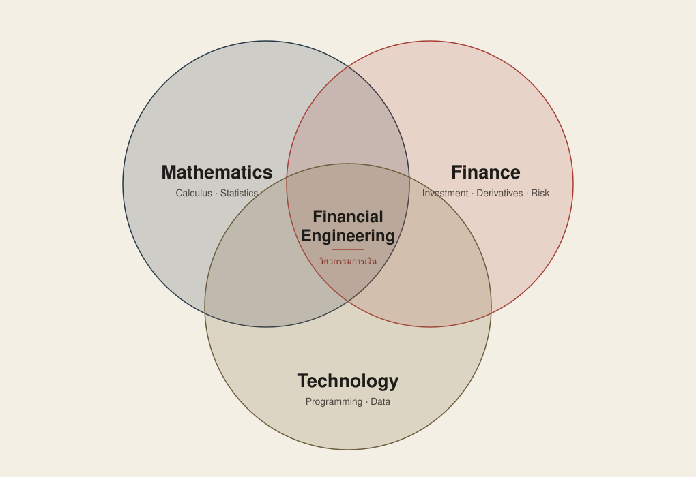

**สรุปก่อน**

- **เรียนอะไร** — การเงิน + คณิตศาสตร์ + สถิติ + เทคโนโลยี เพื่อประเมินมูลค่าตราสาร วัดผลตอบแทนและความเสี่ยง และสร้างแบบจำลองช่วยตัดสินใจ
- **ต้องรู้อะไรก่อน** — Calculus (ทั้งอนุพันธ์และปริพันธ์) กับ Probability ช่วยมาก และควรคุ้นกับการเขียนพิสูจน์เบื้องต้น ส่วนพื้นฐาน Finance กับ Programming ทำให้ตามบทเรียนง่ายขึ้น แต่ไม่จำเป็นต้องจบสายนี้มา
- **เรียนแบบไหน** — คลาสเสาร์เต็มวัน อาทิตย์ครึ่งวัน เลือกได้ทั้ง Online และ On-site สลับได้ทุกสัปดาห์
- **เหมาะกับใคร** — คนที่อยากเข้าใจการเงินผ่านตัวเลขและแบบจำลอง ไม่จำเป็นต้องจบการเงินหรือสายคอมมาโดยตรง แต่ถ้าไม่อยากแตะสมการเลย สาขานี้อาจไม่ตอบโจทย์

---

ผมเริ่มเรียน M.Sc. in Financial Engineering มาได้ประมาณ 3–4 สัปดาห์ เหตุผลหลักไม่ใช่เพราะตัดสินใจว่าจะย้ายออกจากสาย Software Developer แต่อยากเข้าใจการเงินให้ลึกกว่าเดิม ผมอยากนำความรู้มาจัดการ Portfolio และการเทรดส่วนตัวให้เป็นระบบขึ้น พร้อมกับเพิ่มทางเลือกให้ตัวเองในอนาคต

ก่อนเริ่มเรียน ผมเข้าใจคร่าว ๆ ว่าสาขานี้คือการนำคณิตศาสตร์กับโปรแกรมมาช่วยแก้ปัญหาการเงิน แต่พอได้เรียน 3 วิชาแรก—ตราสารอนุพันธ์ สถิติ และทฤษฎีการลงทุน—พร้อมกัน ภาพเริ่มชัดขึ้นว่าไม่ใช่เพียงการเขียนโปรแกรมเกี่ยวกับหุ้น แต่เป็นจุดที่หลายเรื่องต้องทำงานร่วมกัน

บทความนี้จึงไม่ใช่รีวิวหลักสูตรหลังเรียนจบ แต่เป็นภาพจากช่วงเริ่มต้นว่าเรียนอะไรจริง และพื้นฐานแบบไหนที่ผมคิดว่าช่วยให้ตามเนื้อหาได้ทัน

## วิศวกรรมการเงิน (Financial Engineering) คืออะไร

ในมุมที่ผมเข้าใจตอนนี้ วิศวกรรมการเงิน หรือ Financial Engineering คือการนำ **Finance, Mathematics, Statistics และ Technology** มาใช้แก้ปัญหาทางการเงิน ตั้งแต่การประเมินมูลค่าตราสาร วัดผลตอบแทนและความเสี่ยง ไปจนถึงสร้างแบบจำลองเพื่อช่วยตัดสินใจ

คำว่า Engineering ในที่นี้จึงใกล้กับการออกแบบวิธีแก้ปัญหาภายใต้เงื่อนไขต่าง ๆ เราต้องรู้ว่าตัวเลขที่คำนวณแทนอะไร ตั้งสมมติฐานแบบไหน และผลลัพธ์บอกอะไรได้หรือไม่ได้

แผนภาพนี้ช่วยให้เห็นง่ายขึ้นว่า Financial Engineering อยู่ตรงจุดที่ **Mathematics** (รวมสถิติ), **Finance** และ **Technology** ซ้อนกัน โจทย์อย่าง Option Pricing หรือ Risk Management จึงไม่ได้ใช้ความรู้ด้านใดด้านหนึ่งล้วน ๆ แต่ต้องหยิบหลายด้านมาใช้กับปัญหาเดียวกัน

หลักสูตรที่ผมกำลังเรียนคือ **วิทยาศาสตรมหาบัณฑิต สาขาวิศวกรรมการเงิน (M.Sc. in Financial Engineering)** ของมหาวิทยาลัยหอการค้าไทย (UTCC) เป็นหลักสูตรระดับปริญญาโท ระยะเวลา 2 ปี รวม 42 หน่วยกิต [ข้อมูลของหลักสูตร](https://gs.utcc.ac.th/master-degree/financial-engineering/)

เหตุผลที่ผมเลือกที่นี่ตรงไปตรงมา คือใกล้ที่พักที่สุด ใช้เวลาเดินทางน้อย และเรียน Online ได้ในสัปดาห์ที่ไปไม่สะดวก ผมไม่ได้เทียบเนื้อหาหลักสูตรกับมหาวิทยาลัยอื่นอย่างละเอียด ถ้าเงื่อนไขของคุณต่างจากนี้ เช่น ให้น้ำหนักกับชื่อเสียงของหลักสูตรหรือเครือข่ายศิษย์เก่ามากกว่า ก็ควรเทียบหลายที่ก่อนตัดสินใจ

## ค่าเทอมเท่าไหร่

นี่คือตัวเลขที่ผมจ่ายจริงในรุ่นปีการศึกษา 2569 เพื่อให้พอเห็นขนาดของค่าใช้จ่าย ไม่ใช่อัตราที่รับรองว่าจะใช้กับรุ่นถัดไป ก่อนสมัครควรเช็กกับมหาวิทยาลัยอีกครั้ง

- **วิชาปรับพื้นฐาน (3 วิชา)** ประมาณ 18,000 บาท
- **เทอมแรก (3 วิชา)** ประมาณ 38,000 บาท

ผมยังไม่ใส่ตัวเลขตลอดหลักสูตร เพราะยังไม่แน่ใจว่ามีภาคฤดูร้อนหรือไม่ และเทอมถัดไปลงกี่วิชา จะกลับมาอัปเดตเมื่อเห็นแผนการเรียนครบ

## วิชาปรับพื้นฐานเรียนอะไร

ก่อนเข้าเทอมแรก มีวิชาปรับพื้นฐาน 3 วิชา วิชาละ 8 สัปดาห์ นับเป็นภาคเรียนที่ 0 ไม่คิดหน่วยกิต และให้ผลเป็น S/U (ผ่าน/ไม่ผ่าน) แทนเกรด

- **SM001 แคลคูลัส**
- **SM002 สถิติธุรกิจ**
- **SM004 การโปรแกรมทางการเงินเบื้องต้น**

ชื่อวิชาทั้งสามบอกอยู่แล้วว่าหลักสูตรคาดหวังพื้นฐานอะไร ซึ่งตรงกับสิ่งที่ผมจะเล่าในหัวข้อถัด ๆ ไป แต่ 8 สัปดาห์ผ่านเร็วมาก ถ้าเคยเรียนมาก่อนบ้าง ช่วงนี้จะเป็นการทบทวน แต่ถ้าเริ่มจากศูนย์ก็ต้องเรียนใหม่ทั้งหมดในเวลาที่จำกัด

## ช่วงแรกเรียนอะไรบ้าง

เทอมแรกผมเรียน 3 วิชา วิชาละ 3 ชั่วโมงต่อสัปดาห์ ตารางตอนนี้คือวันเสาร์ 9:00–12:00 และ 13:00–16:00 กับวันอาทิตย์ 13:00–16:00 (เทอมอื่นตารางอาจต่างออกไป เช่น วันเสาร์ 9:00–12:00 และ 13:00–16:00 กับวันจันทร์ 18:00–21:00 ควรสอบถามคณะโดยตรง) แต่ละวิชาทำให้เห็นคนละด้านของ Financial Engineering

**SM511 — ตราสารหนี้และตราสารอนุพันธ์ (Fixed Income Securities and Derivative Securities)** เริ่มจาก Futures และตอนนี้กำลังเรียน Options เนื้อหาไม่ได้หยุดอยู่ที่ว่าตราสารแต่ละชนิดคืออะไร แต่ลงไปถึงที่มาของราคาและ Payoff (กำไรหรือขาดทุนของสัญญา ณ วันหมดอายุ เมื่อราคาหุ้นไปจบที่ค่าต่าง ๆ) รวมถึง Binomial Model (แบบจำลองที่สมมติว่าราคาหุ้นในแต่ละช่วงขยับได้แค่ขึ้นหรือลง แล้วคำนวณราคา Option ย้อนกลับมา) และ Delta ตรงนี้ทำให้เห็นชัดว่าการเงินกับคณิตศาสตร์ต้องมาด้วยกัน ตำราหลักคือ Hull, *Options, Futures, and Other Derivatives*

**SM512 — ทฤษฎีสถิติ (Statistical Theory)** เริ่มจากสัจพจน์ของความน่าจะเป็นและการพิสูจน์อสมการพื้นฐานอย่าง Boole's inequality ต่อด้วย Conditional Probability และ Bayes' Theorem, Random Variables และ Probability Distributions แล้วไปยัง Bivariate Distributions (การแจกแจงของตัวแปรสุ่ม 2 ตัวพร้อมกัน เช่น ผลตอบแทนของหุ้น 2 ตัว), Statistical Independence และการแจกแจงของฟังก์ชันของตัวแปรสุ่ม (เช่น แสดงว่ากำลังสองของตัวแปรปกติมาตรฐานมีการแจกแจงแบบ Chi-square) วิชานี้มี Problem Set ต่อเนื่องเกือบทุกสัปดาห์ ชุดละ 3–5 ข้อ และตั้งแต่ชุดแรกก็เป็นโจทย์ “จงพิสูจน์” ไม่ใช่โจทย์แทนค่า ผมต้องกลับมาทบทวนคณิตศาสตร์มากที่สุดในวิชานี้ เพราะหัวข้อใหม่ต่อยอดค่อนข้างเร็ว ตำราหลักคือ DeGroot & Schervish, *Probability and Statistics* (4th ed., Pearson)

**SM513 — ทฤษฎีการลงทุน (Investment Theory)** เชื่อมทฤษฎีกับตลาดมากขึ้น ช่วงที่เรียนมาแล้วมี Market Efficiency (สมมติฐานว่าราคาสะท้อนข้อมูลที่มีอยู่แล้ว จึงหากำไรส่วนเกินได้ยาก), Behavioral Finance และ Security Analysis (การวิเคราะห์เพื่อประเมินมูลค่าหลักทรัพย์) ส่วนตอนนี้กำลังเรียน Bond Valuation วิชานี้ทำให้เห็นว่าสถิติไม่ได้จบอยู่ใน SM512 แต่ถูกหยิบมาใช้วิเคราะห์ Return ต่อด้วย ตำราหลักคือ Bodie, Kane & Marcus, *Investments*

สามวิชานี้จึงไม่ได้แยกเป็น “วิชาการเงินหนึ่งวิชา วิชาสถิติหนึ่งวิชา” อย่างเด็ดขาด สิ่งที่เรียนจากวิชาหนึ่งจะกลับมาเป็นเครื่องมือของอีกวิชาหนึ่ง

เรื่องภาษา โจทย์การบ้านที่ผมได้รับ (อย่างน้อยใน SM512) เป็นภาษาไทยที่วงเล็บศัพท์เทคนิคภาษาอังกฤษไว้ เช่น “ฟังก์ชันความหนาแน่นของความน่าจะเป็น (p.d.f.)” ส่วนตำราหลักทั้งสามเล่มเป็นภาษาอังกฤษ จึงต้องอ่านศัพท์เทคนิคภาษาอังกฤษได้ แต่ไม่ต้องกังวลว่าจะต้องฟังหรือเขียนเป็นอังกฤษทั้งหมด

## Financial Engineering ยากไหม? ต้องเก่งเลขแค่ไหน

คำตอบสั้น ๆ คือ ไม่จำเป็นต้องเก่งทุกอย่างก่อนเริ่ม แต่หนีคณิตศาสตร์ไม่พ้น จากที่เรียนมา พื้นฐานที่ส่งผลชัดที่สุดคือ **Algebra และ Calculus** โดยเฉพาะ Calculus ซึ่งโผล่มาแทบทุกบท ทั้งตอนจัดรูปสมการ หาอนุพันธ์ อินทิเกรตหาความน่าจะเป็นจากฟังก์ชันความหนาแน่น และอธิบายว่าตัวแปรหนึ่งเปลี่ยนตามอีกตัวแปรอย่างไร

ตัวอย่างที่เห็นชัดคือ **Delta ของ Option** ซึ่งเขียนเป็น ∂C/∂S หรืออนุพันธ์ของราคา Option เทียบกับราคาหุ้นอ้างอิง พูดง่าย ๆ คือ “ถ้าราคาหุ้นขยับ 1 บาท ราคา Option จะขยับประมาณเท่าไหร่” ถ้าเคยเรียนอนุพันธ์มาก่อน เราจะเชื่อมสัญลักษณ์นี้กับแนวคิดเรื่องความไวของราคาได้เร็วขึ้น แต่ถ้าไม่เคยเห็นเลย ก็ต้องทำความรู้จักทั้งสัญลักษณ์และแนวคิดพร้อมกัน

ตัวอย่างจากฝั่งสถิติ โจทย์ใน SM512 ตั้งแต่สัปดาห์แรก ๆ มักให้ฟังก์ชันที่มีค่าคงที่ c ติดมา เช่น f(x) = ce^(−3x) แล้วถามว่า c ต้องเป็นเท่าไหร่จึงจะเป็นฟังก์ชันความหนาแน่นได้ ซึ่งก็คือการอินทิเกรตตั้งแต่ 0 ถึงอนันต์ให้ได้ 1 พอเป็นตัวแปรสุ่ม 2 ตัว โจทย์เดียวกันกลายเป็น Double Integral บนพื้นที่ที่ขอบเขตเป็นเส้นโค้ง เช่น 0 ≤ y ≤ 1 − x² ถ้าอินทิเกรตไม่คล่อง จะติดตั้งแต่ขั้นตั้งโจทย์ ยังไม่ทันได้คิดเรื่องความน่าจะเป็นเลย

สิ่งที่ผมไม่ได้เตรียมมาและควรเตรียมคือ **การเขียนพิสูจน์** Problem Set ชุดแรกของ SM512 เป็นโจทย์ “จงแสดงว่า” และ “จงพิสูจน์” ทั้งชุด เช่น พิสูจน์อสมการของความน่าจะเป็นด้วย induction หรือ de Morgan's laws ทำให้ต้องรื้อเรื่องเซต (union, intersection, complement) และวิธีเขียนพิสูจน์ให้เป็นขั้นเป็นตอน ซึ่งเป็นคนละทักษะกับการคำนวณ

ถ้าไม่เคยเรียน Calculus มาก่อน ผมคิดว่าควรอ่านมาพอสมควรก่อนเริ่ม เพราะในห้องเนื้อหาเดินค่อนข้างเร็ว ตอนนี้ผมใช้เวลาอ่านและทำโจทย์นอกห้องราว 6 ชั่วโมงต่อสัปดาห์ ส่วนใหญ่หมดไปกับ Problem Set ของ SM512 โดยที่เคยเรียน Calculus มาแล้ว คนที่เริ่มจากศูนย์น่าจะต้องเผื่อมากกว่านี้ อาจถึง 2–3 เท่า ตัวเลขนี้เป็นของผมคนเดียว ไม่ใช่ผลจากการวัด และ Calculus ก็ไม่ใช่เกณฑ์รับสมัคร เป็นเพียงเวลาที่ควรเผื่อไว้เพื่อให้ตามบทเรียนทัน

### ควรทบทวนคณิตศาสตร์ระดับไหน

ถ้าย้อนกลับไปเตรียมตัวใหม่และมีเวลาจำกัด ผมจะเรียงตามหัวข้อที่เจอก่อนในห้อง ไม่ได้เรียงตามลำดับวิชา Calculus 1–2–3 ของมหาวิทยาลัย

1. **Limit, Derivative และกฎการหาอนุพันธ์** (อยู่ใน Calculus 1) — ใช้ทันทีตั้งแต่เรื่อง Delta ของ Option และใช้หา p.d.f. จาก C.D.F.
2. **Integration** (อยู่ใน Calculus 2) — โดยเฉพาะปริพันธ์ของ e^(−ax) กับ xⁿ และการอินทิเกรตจาก 0 ถึงอนันต์ ใช้หาค่าคงที่ของ p.d.f. และ C.D.F. ตั้งแต่ Problem Set ที่ 3 ของ SM512
3. **เซตและการเขียนพิสูจน์เบื้องต้น** — union, intersection, complement, de Morgan's laws และ induction ใช้ตั้งแต่ Problem Set แรกของ SM512
4. **Probability เบื้องต้น** (รวม Conditional Probability และ Bayes' Theorem) และ **Linear Algebra เบื้องต้น** ควบคู่กัน — Probability ใช้ตรง ๆ ใน SM512 ส่วน Linear Algebra ช่วยเมื่อเจอเมทริกซ์และหลายตัวแปร
5. **Partial Derivative, Optimization และ Double Integral บนพื้นที่ที่ขอบเขตไม่ใช่สี่เหลี่ยม** (อยู่ใน Calculus 3) — เชื่อมกับ Greeks (ค่าความไวของราคา Option ต่อปัจจัยต่าง ๆ ซึ่ง Delta เป็นตัวหนึ่ง) และ Bivariate Distributions
6. **Taylor Series** (อยู่ใน Calculus 2) — ยังไม่เจอตรง ๆ ในช่วงแรก เก็บไว้ทีหลังได้

อีกส่วนคือ **Probability และ Statistics** อย่างน้อยควรคุ้นกับค่าเฉลี่ย ความแปรปรวน การแจกแจงความน่าจะเป็น ความน่าจะเป็นแบบมีเงื่อนไข และ Regression เพราะสถิติไม่ได้ใช้เฉพาะใน SM512 ใน SM513 เราใช้ Regression Analysis วิเคราะห์ Return โดยอ่าน coefficient เพื่อดูทิศทางและขนาดของความสัมพันธ์ และอ่าน p-value ประกอบการประเมินผล โดยยังไม่จำเป็นต้องเริ่มจากการจำสูตรทั้งหมด

### ต้องเขียนโปรแกรมเป็นไหม ใช้ภาษาอะไร

เครื่องมือที่ใช้ในคลาสตอนนี้คือ **Excel และ Python** ถ้าเคยเขียนโปรแกรมหรือจัดการข้อมูลมาก่อนจะช่วยตอนคำนวณและทดลองกับข้อมูล แต่จากที่เรียนถึงตอนนี้ ยังไม่ถึงกับต้องเขียนโปรแกรมเป็นก่อนจึงจะเริ่มได้ ใช้ Excel คล่องและเคยแตะ Python มาบ้างก็น่าจะตามช่วงแรกได้ง่ายขึ้น

ตัวอย่างที่เจอจริง แม้แต่ใน SM512 ซึ่งเป็นวิชาทฤษฎี ก็มีการบ้านบางข้อที่ให้ไฟล์ CSV ข้อมูลกองทุนรวม (ชื่อกองทุน ประเภทสินทรัพย์ นโยบายลงทุนในหรือต่างประเทศ) มานับสัดส่วนและทำตาราง cross-tab เพื่อตอบคำถามความน่าจะเป็น รวมถึงข้อที่ให้วาดกราฟ p.d.f. และ C.D.F. งานแบบนี้ทำได้ทั้ง Excel และ Python ไม่ต้องเขียนโค้ดซับซ้อน แต่ต้องโหลดข้อมูล กรอง และนับเป็น

พื้นฐานการเงินช่วยให้เข้าใจบริบทของตราสาร ผลตอบแทน และความเสี่ยงได้เร็วขึ้น แต่ไม่จำเป็นต้องจบการเงินมาโดยตรง

สรุปคือไม่จำเป็นต้องเก่งทุกด้านก่อนสมัคร แต่ถ้ามีเวลาจำกัด ผมจะให้น้ำหนักกับการทบทวน Calculus และ Statistics ก่อน เพราะสองอย่างนี้ช่วยลดเวลาที่ต้องหยุดกลับไปปูพื้นระหว่างเรียนได้มากที่สุด

ในทางกลับกัน ถ้าคุณอยากเข้าใจการเงินแต่ไม่อยากแตะสมการเลย สาขานี้อาจไม่ตอบโจทย์ เพราะแทบทุกวิชาเดินเรื่องผ่านสมการและการพิสูจน์ หลักสูตรสายการเงินทั่วไปหรือ MBA อาจตรงกับความต้องการมากกว่า

## เรียน Online หรือ On-site ได้ไหม

สำหรับรุ่นที่ผมกำลังเรียน คลาสอยู่ในวันเสาร์เต็มวันและวันอาทิตย์ครึ่งวัน เลือกเข้าได้ทั้ง Online และ On-site และ **สลับได้ทุกสัปดาห์** ตามความสะดวก ไม่ต้องเลือกแบบใดแบบหนึ่งตั้งแต่สมัคร คลาส Online เป็นการเรียนสดและมีวิดีโอย้อนหลัง จึงช่วยได้มากในสัปดาห์ที่เดินทางมาไม่ได้หรือต้องจัดเวลาเรียนคู่กับงาน

ถ้าจัดเวลาได้ ผมแนะนำให้เข้า On-site ใน 1–2 สัปดาห์แรกของแต่ละวิชา จะได้ฟังแนวทางการเรียน การสอบ และความคาดหวังของอาจารย์ให้ครบ เพราะแต่ละท่านอาจจัดวิชาไม่เหมือนกัน ส่วนรูปแบบ Online/On-site ที่เล่าตรงนี้เป็นของรุ่นผม ปีถัดไปอาจเปลี่ยนได้

ส่วนตัวผมเลือกเรียน On-site เป็นหลัก เพราะมีสมาธิกว่าและตามขั้นตอนการอธิบายบนกระดานได้ต่อเนื่องกว่า แต่นี่เป็นเรื่องของรูปแบบที่เหมาะกับแต่ละคน ไม่ได้หมายความว่า On-site ดีกว่าเสมอไป วิดีโอย้อนหลังก็มีประโยชน์มากเมื่ออยากกลับไปดูขั้นตอนคำนวณที่ตามไม่ทันในรอบแรก

## เพื่อนร่วมชั้นมาจากสายไหนบ้าง

เพื่อนร่วมชั้นหลากหลายกว่าที่ผมคิด มีตั้งแต่วัยเลข 2 ไปจนถึงวัยเลข 4 ทั้งคนที่เพิ่งจบปริญญาตรีและคนที่ทำงานมาหลายปี พื้นเพก็มีทั้งบริหารธุรกิจ เศรษฐศาสตร์ การตลาด และวิศวกรรมศาสตร์ ไม่ได้มีเฉพาะคนจบการเงินหรือคอมพิวเตอร์ ถ้ากังวลว่ามาจากสายอื่นแล้วจะเรียนได้ไหม อย่างน้อยในห้องนี้ก็มีคนเริ่มจากพื้นฐานที่ต่างกันอยู่ไม่น้อย

## เรียนจบแล้วทำงานอะไร (เท่าที่รู้ตอนนี้)

คำตอบตรง ๆ คือตอนนี้ผมยังตอบจากประสบการณ์ตัวเองไม่ได้ เพราะเพิ่งเรียนมาไม่ถึงเดือน เส้นทางที่มักถูกพูดถึงมี Quantitative Analyst (Quant), Risk Management, Portfolio Management และงานสาย FinTech แต่ผมขอเก็บรายละเอียดไว้เขียนอีกครั้ง เมื่อได้คุยกับรุ่นพี่และเห็นเนื้อหาในปีถัดไปมากกว่านี้

สำหรับผม เป้าหมายแรกยังไม่ใช่การเปลี่ยนสายงาน แต่อยากนำความรู้เรื่องตราสาร ความเสี่ยง และแบบจำลองมาจัดการ Portfolio กับการเทรดของตัวเองให้มีหลักการขึ้น ส่วนจะต่อยอดไปทางไหน ค่อยตอบเมื่อเรียนไปไกลกว่านี้

## หลังเรียนมา 3–4 สัปดาห์ ผมมองสาขานี้อย่างไร

สิ่งที่ต่างจากที่คาดคือคณิตศาสตร์และสถิติเข้มตั้งแต่ช่วงต้น และแต่ละวิชาเชื่อมกันมากกว่าที่คิด Calculus ที่พบในวิชาหนึ่งอาจกลับมาใช้กับตราสาร ส่วน Statistics เชิงทฤษฎีก็ถูกนำไปอ่านผลการวิเคราะห์ Return ในอีกวิชา

ตอนนี้ยังเร็วเกินไปที่ผมจะสรุปว่าหลักสูตรทั้งหมดหนักแค่ไหน หรือคุ้มค่าหรือไม่ ผมรู้เพียงว่าพื้นฐานที่ควรเตรียมไม่ได้มีแค่ Programming สำหรับคนที่มาจากสาย Developer และไม่ได้มีแค่ Finance สำหรับคนที่มาจากสายการเงิน—Calculus กับ Statistics คือภาษากลางที่ต้องใช้เชื่อมทุกอย่างเข้าด้วยกัน

บทความต่อ ๆ ไปในซีรีส์นี้จะค่อย ๆ บันทึกจากสิ่งที่เรียนจริง รวมถึงเรื่องที่ยังไม่เข้าใจ โดยไม่พยายามรีบสรุปปลายทางตั้งแต่เพิ่งเริ่มต้น
